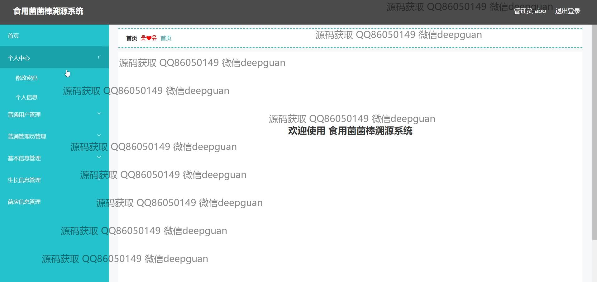

<h1 align="center">食用菌菌棒溯源系统的开发与设计+vue</h1>

## 简介
食用菌菌棒溯源系统：角色分为管理员、用户；支持用户管理、基本信息管理、生长信息管理、菌房信息管理，能编辑、追踪和查询菌棒相关数据，提供便捷的用户界面与操作。    --计算机毕业设计源码；毕设源码；java毕业设计源码

## 联系方式

<h3 align="center">获取完整代码与数据库文件 + 微信：deepguan QQ: 86050149 QQ群: 783742310</h3>

<h3 align="center">可帮忙远程部署 包运行成功！提供远程部署、修改代码、设计文档指导、代码讲解等服务！</h3>

## 功能介绍（完整见运行截图）
管理员：基本功能包括登录、注册、退出和主页访问，拥有主导航菜单，用于管理普通用户及管理员、基本信息维护和生长信息追踪。可以查看、增删改查用户和菌棒信息，编辑个人资料如账号、密码、联系方式等。支持信息检索、富文本编辑、图片上传及用户身份管理。可以查看及编辑菌房信息，操作简便易于实现信息管理。

普通用户：可以进行登录、注册和退出操作，进入系统后可通过导航菜单访问“个人中心”以查看和修改个人信息。能够查看并管理自身关联的食用菌菌棒信息，操作包括查看菌棒详情、增长情况及环境参数。可以增删改查个人信息如密码、姓名、电话和上传个人照片，便于维护自己的基本信息记录。

管理员和用户共享功能：两者都可以访问个性化的“个人中心”以查看和修改个人信息，支持基本信息管理和生长信息管理。能够通过简单的界面进行食用菌菌棒的数据录入、编辑、追踪与管理。允许对菌棒列表的编号、种类、类别及信息进行查询、修改或删除，确保信息的安全和准确信息的及时更新。

## 运行截图

本代码来源于网络,仅供学习参考使用!

